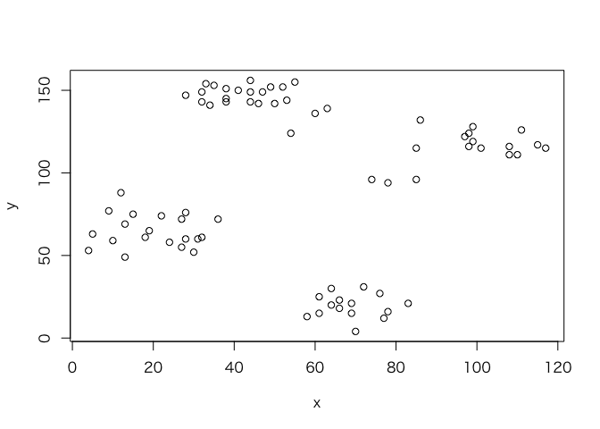

2018-02-19

学習器の訓練
============

学習機の訓練というのはモデルをデータセットに適合させることを指す。`mlr`パッケージでは、`train`関数を学習器と適切なタスクに対し呼び出すことで実行できる。

まずは分類問題の例として、irisデータセットで線形判別分析を行ってみよう。

``` r
## タスクの作成
task = makeClassifTask(data = iris, target = "Species")

## 学習器の作成
lrn = makeLearner("classif.lda")

## 学習器の訓練
mod = train(lrn, task)
mod
```

    $> Model for learner.id=classif.lda; learner.class=classif.lda
    $> Trained on: task.id = iris; obs = 150; features = 4
    $> Hyperparameters:

上記の例では実際には明示的に学習器を作成する必要はない。学習器のデフォルト値(ハイパーパラメータや予測タイプなど)を変更したい場合には、明示的に学習器を作成する必要がある。そうでなければ、`train`や他の多くの関数にはLernerのクラス名を指定すればよい。そうすればデフォルトの設定で`makeLearner`が呼び出され、学習器に指定される。

``` r
mod = train("classif.lda", task)
mod
```

    $> Model for learner.id=classif.lda; learner.class=classif.lda
    $> Trained on: task.id = iris; obs = 150; features = 4
    $> Hyperparameters:

どのようなタイプの問題でも、学習器の訓練の仕方は同じだ。生存時間分析の例として、コックス比例ハザードモデルを`lung`データセットに適用する例を示す(タスクとして`mlr`パッケージに予め用意されている`lung.task`を使用している点に注意してもらいたい)。

``` r
mod = train("surv.coxph", lung.task)
mod
```

    $> Model for learner.id=surv.coxph; learner.class=surv.coxph
    $> Trained on: task.id = lung-example; obs = 167; features = 8
    $> Hyperparameters:

学習器モデルへのアクセス
------------------------

`train`関数は`WrappedModel`クラスのオブジェクトを返す。このオブジェクトはフィット済みのモデル、すなわち基礎となるRの学習メソッドの出力をカプセル化している。加えて、オブジェクトには学習器、タスク、訓練に使った特徴量と観測値、訓練にかかった時間なども含まれている。`WrappedModel`は続けて新しい観測値を使った予測に使用することができる。

フィット済みモデルは`$learner.model`スロットに入っており、`getLearnerModel`関数でアクセスできる。

以下に`ruspini`データセット(これは4つのグループと2つの特徴量を持つ)を*K*=4の*K*-means法でクラスタ化する例を示すとともに、基本となる`kmeans`関数から出力を抽出する。

``` r
data(ruspini, package = "cluster")
plot(y~x, ruspini)
```



``` r
## タスクの作成
ruspini.task = makeClusterTask(data = ruspini)
## 学習器の作成
lrn = makeLearner("cluster.kmeans", centers = 4)
## 学習機の訓練
mod = train(lrn, ruspini.task)
mod
```

    $> Model for learner.id=cluster.kmeans; learner.class=cluster.kmeans
    $> Trained on: task.id = ruspini; obs = 75; features = 2
    $> Hyperparameters: centers=4
