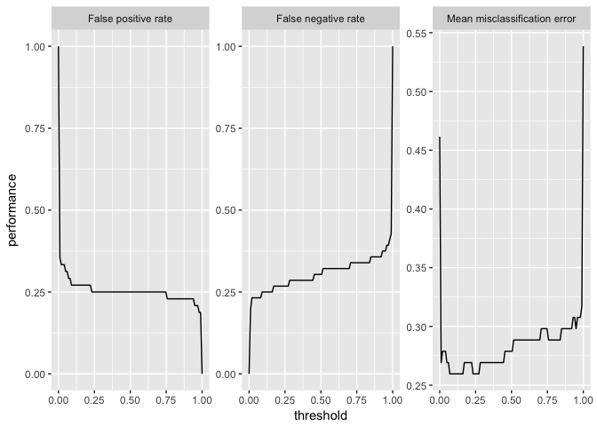

2018-02-25

学習器の性能を評価する
======================

`mlr`には学習機の予測性能について様々な側面から評価する方法が備えられている。性能指標を計算するためには、`predict`の返すオブジェクトと目的の性能指標を指定して`performance`関数を呼び出す。

利用可能な性能指標
------------------

`mlr`はすべての種類の学習問題に対して多数の性能指標を提供している。分類問題に対する典型的な性能指標としては、平均誤分類率(mmce)、精度(acc)、ROC曲線などが使える。回帰問題に対しては、平均二乗偏差(mse)、平均絶対誤差(mae)などが一般に使用される。他にもクラスタリング問題では、Dunn Index(dunn)が、生存時間分析に対してはConcordance Index(cindex)が、コスト考慮型予測問題ではMisclassification Penalty(mcp)など、様々な指標が利用可能である。また、訓練にかかった時間(timetrain)、予測にかかった時間(timepredict)、その合計(timeboth)も性能指標の一つとしてアクセスできる。

どのような指標が実装されているかについては、[Implemented Performance Measures - mlr tutorial](https://mlr-org.github.io/mlr-tutorial/devel/html/measures/index.html)および[measures function | R Documentation](https://www.rdocumentation.org/packages/mlr/versions/2.10/topics/measures)を確認してもらいたい。

もし新たな指標を実装したり、標準的でない誤分類コストを指標に含めたいと思うのであれば、[Create Custom Measures - mlr tutorial](https://mlr-org.github.io/mlr-tutorial/devel/html/create_measure/index.html)を見てもらいたい。

指標の一覧
----------

各指標の詳細については上述のImplemented Performance Measuresを確認してもらうとして、特定のプロパティを持つ指標や、特定のタスクに利用可能な指標を確認したければ`listMeasures`関数を使うと良い。

``` r
## 多クラス問題に対する分類指標
listMeasures("classif", properties = "classif.multi")
```

    $>  [1] "kappa"            "multiclass.brier" "multiclass.aunp" 
    $>  [4] "multiclass.aunu"  "qsr"              "ber"             
    $>  [7] "logloss"          "wkappa"           "timeboth"        
    $> [10] "timepredict"      "acc"              "lsr"             
    $> [13] "featperc"         "multiclass.au1p"  "multiclass.au1u" 
    $> [16] "ssr"              "timetrain"        "mmce"

``` r
## iris.taskに対する分類指標
listMeasures(iris.task)
```

    $>  [1] "kappa"            "multiclass.brier" "multiclass.aunp" 
    $>  [4] "multiclass.aunu"  "qsr"              "ber"             
    $>  [7] "logloss"          "wkappa"           "timeboth"        
    $> [10] "timepredict"      "acc"              "lsr"             
    $> [13] "featperc"         "multiclass.au1p"  "multiclass.au1u" 
    $> [16] "ssr"              "timetrain"        "mmce"

簡便のため、それぞれの学習問題に対しては、よく使われる指標がデフォルトとして指定してある。例えば回帰では平均二乗偏差が、分類では平均誤分類率がデフォルトだ。何がデフォルトであるかは`getDefaultMeasure`関数を使うと確認できる。また、この関数のヘルプでデフォルトに使用される指標の一覧が確認できる。

``` r
## iris.taskのデフォルト指標
getDefaultMeasure(iris.task)
```

    $> Name: Mean misclassification error
    $> Performance measure: mmce
    $> Properties: classif,classif.multi,req.pred,req.truth
    $> Minimize: TRUE
    $> Best: 0; Worst: 1
    $> Aggregated by: test.mean
    $> Note: Defined as: mean(response != truth)

``` r
## 回帰のデフォルト指標
getDefaultMeasure(makeLearner("regr.lm"))
```

    $> Name: Mean of squared errors
    $> Performance measure: mse
    $> Properties: regr,req.pred,req.truth
    $> Minimize: TRUE
    $> Best: 0; Worst: Inf
    $> Aggregated by: test.mean
    $> Note: Defined as: mean((response - truth)^2)

性能指標を計算する
------------------

例として、勾配ブースティングマシンを`BostonHousing`データの一部に適用し、残りのデータから標準の性能指標である平均二乗偏差を計算してみよう。

``` r
n = getTaskSize(bh.task)
lrn = makeLearner("regr.gbm", n.trees = 1000)
mod = train(lrn, task = bh.task, subset = seq(1, n, 2))
pred = predict(mod, task = bh.task, subset = seq(2, n, 2))

performance(pred)
```

    $>      mse 
    $> 42.85008

他の指標の例として中央値二乗誤差(medse)を求めてみよう。

``` r
performance(pred, measures = medse)
```

    $>    medse 
    $> 8.930711

もちろん、独自に作成した指標も含めて、複数の指標を一度に計算することもできる。その場合、求めたい指標をリストにして渡す。

``` r
performance(pred, measures = list(mse, medse, mae))
```

    $>       mse     medse       mae 
    $> 42.850084  8.930711  4.547737

上記の方法は、学習問題や性能指標の種類が異なっても基本的には同じである。

指標計算に必要な情報
--------------------

一部の性能指標では、計算のために予測結果だけでなく、タスクやフィット済みモデルも必要とする。

一例は訓練にかかった時間(timetrain)だ。

``` r
performance(pred, measures = timetrain, model = mod)
```

    $> timetrain 
    $>     0.082

クラスター分析に関わる多くの性能指標はタスクを必要とする。

``` r
lrn = makeLearner("cluster.kmeans", centers = 3)
mod = train(lrn, mtcars.task)
pred = predict(mod, task = mtcars.task)

performance(pred, measures = dunn, task = mtcars.task)
```

    $>      dunn 
    $> 0.1462919

また、いくつかの指標は特定の種類の予測を必要とする。例えば2クラス分類におけるAUC(これはROC\[receiver operating characteristic\]曲線の下側の面積\[Area Under Curve\]である)を計算するためには、事後確率が必要である。ROC分析に関する詳細が必要であれば[ROC Analysis - mlr tutorial](https://mlr-org.github.io/mlr-tutorial/devel/html/roc_analysis/index.html)を確認してほしい。

``` r
lrn = makeLearner("classif.rpart", predict.type = "prob")
mod = train(lrn, task = sonar.task)
pred = predict(mod, task = sonar.task)

performance(pred, measures = auc)
```

    $>       auc 
    $> 0.9224018

また、分類問題に利用可能な性能指標(偽陽性率fprなど)の多くは、2クラス分類のみに利用可能であるという点に注意してもらいたい。

性能指標へのアクセス
--------------------

`mlr`における性能指標は`Measure`クラスのオブジェクトである。オブジェクトを通じて指標のプロパティ等には直接アクセスすることができる。各スロットに関する説明は[makeMeasure function | R Documentation](https://www.rdocumentation.org/packages/mlr/versions/2.10/topics/makeMeasure)を確認してもらいたい。

``` r
str(mmce)
```

    $> List of 10
    $>  $ id        : chr "mmce"
    $>  $ minimize  : logi TRUE
    $>  $ properties: chr [1:4] "classif" "classif.multi" "req.pred" "req.truth"
    $>  $ fun       :function (task, model, pred, feats, extra.args)  
    $>  $ extra.args: list()
    $>  $ best      : num 0
    $>  $ worst     : num 1
    $>  $ name      : chr "Mean misclassification error"
    $>  $ note      : chr "Defined as: mean(response != truth)"
    $>  $ aggr      :List of 4
    $>   ..$ id        : chr "test.mean"
    $>   ..$ name      : chr "Test mean"
    $>   ..$ fun       :function (task, perf.test, perf.train, measure, group, pred)  
    $>   ..$ properties: chr "req.test"
    $>   ..- attr(*, "class")= chr "Aggregation"
    $>  - attr(*, "class")= chr "Measure"

2クラス分類
-----------

### 性能と閾値の関係をプロットする

2クラス分類問題においては、予測された確率からクラスラベルへの割り当てを行う際の確率の閾値を設定できるということを思い出してもらいたい。`generateThreshVsPrefData`と`plotThreshVsPref`は、学習器のパフォーマンスと閾値の関係をプロットできる便利な関数だ。

パフォーマンスのプロットと閾値の自動チューニングに関して詳しい情報は[ROC Analysis - mlr tutorial](https://mlr-org.github.io/mlr-tutorial/devel/html/roc_analysis/index.html)を確認してほしい。

以下の例では、`Sonar`データセットを用い、偽陽性率(fpr)、偽陰性率(fnr)、平均誤分類率(mmce)を設定可能な範囲の閾値に対してプロットしている。

``` r
lrn = makeLearner("classif.lda", predict.type = "prob")
n = getTaskSize(sonar.task)
mod = train(lrn, task = sonar.task, subset = seq(1, n, by = 2))
pred = predict(mod, task = sonar.task, subset = seq(2, n, by = 2))

d = generateThreshVsPerfData(pred, measures = list(fpr, fnr, mmce))
plotThreshVsPerf(d)
```



`ggvis`を利用した`plotThreshVsPerfGGVIS`関数は、Shinyを使ったインタラクティブなグラフを生成する。

``` r
plotThreshVsPerfGGVIS(d)
```

### ROC

2クラス分類においては、多数の分類指標が存在するが、これは1つの表としてまとめることができる。例えばROCに関するWikipediaのページ[Receiver operating characteristic - Wikipedia](https://en.wikipedia.org/wiki/Receiver_operating_characteristic)を見てもらいたい(訳注:日本語版の受信者操作特性のページには無い)。

これと同じようなものを`calculateROCMeasures`関数を用いると作成できる。

``` r
calculateROCMeasures(pred)
```

    $>     predicted
    $> true M         R                            
    $>    M 0.7       0.3       tpr: 0.7  fnr: 0.3 
    $>    R 0.25      0.75      fpr: 0.25 tnr: 0.75
    $>      ppv: 0.76 for: 0.32 lrp: 2.79 acc: 0.72
    $>      fdr: 0.24 npv: 0.68 lrm: 0.4  dor: 6.88
    $> 
    $> 
    $> Abbreviations:
    $> tpr - True positive rate (Sensitivity, Recall)
    $> fpr - False positive rate (Fall-out)
    $> fnr - False negative rate (Miss rate)
    $> tnr - True negative rate (Specificity)
    $> ppv - Positive predictive value (Precision)
    $> for - False omission rate
    $> lrp - Positive likelihood ratio (LR+)
    $> fdr - False discovery rate
    $> npv - Negative predictive value
    $> acc - Accuracy
    $> lrm - Negative likelihood ratio (LR-)
    $> dor - Diagnostic odds ratio

左上の2x2行列は混同行列であり、正しく分類された観測値と誤分類された観測値の相対頻度を示している。また、その右側と下側には、混同行列から計算可能な多数の性能指標が示されている。また、デフォルトでは各項目に対する説明が追記されるが、これは`print`に`abbreviations = FALSE`を指定することで消すことも出来る。

``` r
print(calculateROCMeasures(pred), abbreviations = FALSE)
```

    $>     predicted
    $> true M         R                            
    $>    M 0.7       0.3       tpr: 0.7  fnr: 0.3 
    $>    R 0.25      0.75      fpr: 0.25 tnr: 0.75
    $>      ppv: 0.76 for: 0.32 lrp: 2.79 acc: 0.72
    $>      fdr: 0.24 npv: 0.68 lrm: 0.4  dor: 6.88
