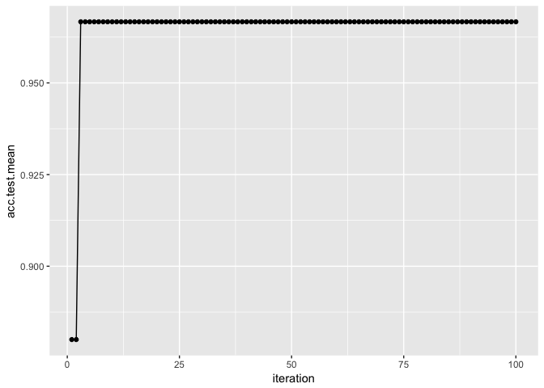

2018-02-25

ハイパーパラメータのチューニング
================================

多くの機械学習アルゴリズムはハイパーパラメータを持っている。学習器のチュートリアルでも説明したが、ハイパーパラメータとして特定の値を設定したければその値を`makeLearner`に渡すだけで良い。しかし、ハイパーパラメータの最適な値というのは大抵の場合は自明ではなく、できれば自動的に調整する手法が欲しい。

機械学習アルゴリズムをチューニングするためには、以下の点を指定する必要がある。

-   パラメータの探索範囲
-   最適化アルゴリズム(チューニングメソッドとも呼ぶ)
-   評価手法(すなわち、リサンプリング手法と性能指標)

パラメータの探索範囲: 例としてサポートベクターマシン(SVM)におけるパラメータ`C`の探索範囲を指定してみよう。

``` r
ps = makeParamSet(
  makeNumericParam("C", lower = 0.01, upper = 0.1)
)
```

最適化アルゴリズム: 例としてランダムサーチを指定してみよう。

``` r
ctrl = makeTuneControlRandom(maxit = 100L)
```

評価手法: リサンプリング手法として3分割クロスバリデーションを、性能指標として精度を指定してみよう。

``` r
rdesc = makeResampleDesc("CV", iter = 3L)
measure = acc
```

評価手法の指定方法については既に説明したところであるので、ここから先は探索範囲と最適化アルゴリズムの指定方法と、チューニングをどのように行い、結果にどのようにアクセスし、さらにチューニング結果を可視化する方法について幾つかの例を通して説明していこう。

このセクションを通して、例としては分類問題を取り上げるが、他の学習問題についても同様の手順で実行できるはずだ。

このさき、irisの分類タスクを使用して、SVMのハイパーパラメータを放射基底関数(RBF)カーネルを使ってチューニングする例を説明する。以下の例では、コストパラメータ`C`と、RBFカーネルのパラメータ`sigma`をチューニングする。

パラメータ探索空間の指定
------------------------

チューニングの際にまず指定しなければならないのは値の探索範囲である。これは例えば"いくつかの値の中のどれか"かもしれないし、"10<sup>−10</sup>から10<sup>10</sup>までの間の中のどこか"かもしれない。

探索空間の指定に際して、パラメータの探索範囲についての情報を含む`ParamSet`オブジェクトを作成する。これには`makeParamSet`関数を用いる。

例として、パメータ`C`と`sigma`の探索範囲を両方共0.5, 1.0, 1.5, 2.0という離散値に設定する例を見よう。それぞれのパラメータにどのような名前が使われているのかは、`kernlab`パッケージで定義されている(cf. [kernlab package | R Documentation](https://www.rdocumentation.org/packages/kernlab/versions/0.9-25))。

``` r
discrete_ps = makeParamSet(
  makeDiscreteParam("C", values = c(0.5, 1.0, 1.5, 2.0)),
  makeDiscreteParam("sigma", values = c(0.5, 1.0, 1.5, 2.0))
)
discrete_ps
```

    $>           Type len Def      Constr Req Tunable Trafo
    $> C     discrete   -   - 0.5,1,1.5,2   -    TRUE     -
    $> sigma discrete   -   - 0.5,1,1.5,2   -    TRUE     -

連続値の探索範囲を指定する際には`makeDiscreteParam`の代わりに`makeNumericParam`を使用する。また、探索範囲として10<sup>−10</sup>から10<sup>10</sup>のような範囲を指定する際には、`trafo`引数に変換用の関数を指定できる(trafoはtransformationの略)。変換用の関数を指定した場合、変換前のスケールで行われ、学習アルゴリズムに値を渡す前に変換が行われる。

``` r
num_ps = makeParamSet(
  makeNumericParam("C", lower = -10, upper = 10, trafo = function(x) 10^x),
  makeNumericParam("sigma", lower = -10, upper = 10, trafo = function(x) 10^x)
)
```

他にも数多くのパラメータが利用できるが、詳しくは[makeParamSet function | R Documentation](https://www.rdocumentation.org/packages/ParamHelpers/versions/1.10/topics/makeParamSet)を確認してもらいたい。

パラメータをリストの形で指定しなければならない関数もあるが、`mlr`を通じてその関数を扱う場合、`mlr`はできるかぎりリスト構造を除去し、パラメータを直接指定できるように試みる。例えばSVMを実行する関数の`ksvm`は、`kpar`引数に`sigma`のようなカーネルパラメータをリストで渡す必要がある。今例を見たように、`mlr`は`sigma`を直接扱うことができる。この仕組みのおかげで、`mlr`は様々なパッケージの学習器を統一したインターフェースで扱うことができるのだ。

最適化アルゴリズムの指定
------------------------

パラメータの探索範囲を決めたら次は最適化アルゴリズムを指定する。`mlr`において最適化アルゴリズムは`TuneControl`クラスのオブジェクトとして扱われる。

グリッドサーチは適切なパラメータを見つけるための標準的な(しかし遅い)方法の一つだ。

先に例を挙げた`discrete_ps`の場合、グリッドサーチは単純に値の全ての組合せを探索する。

``` r
ctrl = makeTuneControlGrid()
```

`num_ps`の場合は、グリッドサーチは探索範囲をまず均等なサイズのステップに分割する。標準では分割数は10だが、これは`resolution`引数で変更できる。ここでは`resolution`に15を指定してみよう。なお、ここで言う均等な15分割というのは、`10^seq(-10, 10, length.out = 15)`という意味である。

``` r
ctrl = makeTuneControlGrid(resolution = 15L)
```

クロスバリデーション以外にも多くの最適化アルゴリズムが利用可能であるが、詳しくは[TuneControl function | R Documentation](https://www.rdocumentation.org/packages/mlr/versions/2.10/topics/TuneControl)を確認してもらいたい。

グリッドサーチは一般的には遅すぎるので、ランダムサーチについても検討してみよう。ランダムサーチはその名の通り値をランダムに選択する。`maxit`引数に試行回数を指定できる。

``` r
ctrl = makeTuneControlRandom(maxit = 200L)
```

チューニングの実行
------------------

パラメータの探索範囲と最適化アルゴリズムを決めたら、いよいよチューニングの実行の時だ。あとは、リサンプリング手法と評価尺度を設定する必要がある。

今回は3分割クロスバリデーションをパラメータ設定の評価に使用する。まずはリサンプリングdescriptionを生成する。

``` r
rdesc = makeResampleDesc("CV", iters = 3L)
```

では、今まで作成したものを組合せて、`tuneParams`関数によりパラメータチューニングを実行しよう。今回は`discrete_ps`に対してグリッドサーチを行う。

``` r
ctrl = makeTuneControlGrid()
res = tuneParams("classif.ksvm", task = iris.task, resampling = rdesc,
                 par.set = discrete_ps, control = ctrl)
```

    $> [Tune] Started tuning learner classif.ksvm for parameter set:

    $>           Type len Def      Constr Req Tunable Trafo
    $> C     discrete   -   - 0.5,1,1.5,2   -    TRUE     -
    $> sigma discrete   -   - 0.5,1,1.5,2   -    TRUE     -

    $> With control class: TuneControlGrid

    $> Imputation value: 1

    $> [Tune-x] 1: C=0.5; sigma=0.5

    $> [Tune-y] 1: mmce.test.mean=0.0533; time: 0.0 min

    $> [Tune-x] 2: C=1; sigma=0.5

    $> [Tune-y] 2: mmce.test.mean=0.06; time: 0.0 min

    $> [Tune-x] 3: C=1.5; sigma=0.5

    $> [Tune-y] 3: mmce.test.mean=0.0533; time: 0.0 min

    $> [Tune-x] 4: C=2; sigma=0.5

    $> [Tune-y] 4: mmce.test.mean=0.0533; time: 0.0 min

    $> [Tune-x] 5: C=0.5; sigma=1

    $> [Tune-y] 5: mmce.test.mean=0.0667; time: 0.0 min

    $> [Tune-x] 6: C=1; sigma=1

    $> [Tune-y] 6: mmce.test.mean=0.0667; time: 0.0 min

    $> [Tune-x] 7: C=1.5; sigma=1

    $> [Tune-y] 7: mmce.test.mean=0.0667; time: 0.0 min

    $> [Tune-x] 8: C=2; sigma=1

    $> [Tune-y] 8: mmce.test.mean=0.0733; time: 0.0 min

    $> [Tune-x] 9: C=0.5; sigma=1.5

    $> [Tune-y] 9: mmce.test.mean=0.0733; time: 0.0 min

    $> [Tune-x] 10: C=1; sigma=1.5

    $> [Tune-y] 10: mmce.test.mean=0.0733; time: 0.0 min

    $> [Tune-x] 11: C=1.5; sigma=1.5

    $> [Tune-y] 11: mmce.test.mean=0.0733; time: 0.0 min

    $> [Tune-x] 12: C=2; sigma=1.5

    $> [Tune-y] 12: mmce.test.mean=0.0733; time: 0.0 min

    $> [Tune-x] 13: C=0.5; sigma=2

    $> [Tune-y] 13: mmce.test.mean=0.0867; time: 0.0 min

    $> [Tune-x] 14: C=1; sigma=2

    $> [Tune-y] 14: mmce.test.mean=0.08; time: 0.0 min

    $> [Tune-x] 15: C=1.5; sigma=2

    $> [Tune-y] 15: mmce.test.mean=0.08; time: 0.0 min

    $> [Tune-x] 16: C=2; sigma=2

    $> [Tune-y] 16: mmce.test.mean=0.0733; time: 0.0 min

    $> [Tune] Result: C=2; sigma=0.5 : mmce.test.mean=0.0533

``` r
res
```

    $> Tune result:
    $> Op. pars: C=2; sigma=0.5
    $> mmce.test.mean=0.0533

`tuneParams`はパラメータの全ての組み合わせに対してクロスバリデーションによる性能評価を行い、最も良い値を出した組合せをパラメータとして採用する。性能指標を指定しなかった場合は誤分類率(mmce)が使用される。

それぞれの`measure`は、その値を最大化すべきか最小化すべきかを**知って**いる。

``` r
mmce$minimize
```

    $> [1] TRUE

``` r
acc$minimize
```

    $> [1] FALSE

もちろん、他の指標をリストとして同時に`tuneParams`に渡すこともできる。この場合、最初の指標が最適化に使われ、残りの指標は単に計算されるだけとなる。もし複数の指標を同時に最適化したいと考えるのであれば、[Advanced Tuning - mlr tutorial](https://mlr-org.github.io/mlr-tutorial/devel/html/advanced_tune/index.html)を参照してほしい。

誤分類率の代わりに精度(acc)を計算する例を示そう。同時に、他の性能指標として精度の標準偏差を求めるため、`setAggregation`関数を使用している。また、今回は探索範囲`num_set`に対して100回のランダムサーチを行う。100回分の出力は長くなるので、`show.info = FALSE`を指定している。

``` r
ctrl = makeTuneControlRandom(maxit = 100L)
res = tuneParams("classif.ksvm", task = iris.task, resampling = rdesc, par.set = num_ps,
                 control = ctrl, measures = list(acc, setAggregation(acc, test.sd)), show.info = FALSE)
res
```

    $> Tune result:
    $> Op. pars: C=1.79e+04; sigma=5.07e-06
    $> acc.test.mean=0.973,acc.test.sd=0.0115

チューニング結果へのアクセス
----------------------------

チューニングの結果は`TuneResult`クラスのオブジェクトである。見つかった最適値は`$x`スロット、性能指標については`$y`スロットを通じてアクセスできる。

``` r
res$x
```

    $> $C
    $> [1] 17936.23
    $> 
    $> $sigma
    $> [1] 5.074312e-06

``` r
res$y
```

    $> acc.test.mean   acc.test.sd 
    $>    0.97333333    0.01154701

最適化されたパラメータをセットした学習器は次のように作成できる。

``` r
lrn = setHyperPars(makeLearner("classif.ksvm"), par.vals = res$x)
lrn
```

    $> Learner classif.ksvm from package kernlab
    $> Type: classif
    $> Name: Support Vector Machines; Short name: ksvm
    $> Class: classif.ksvm
    $> Properties: twoclass,multiclass,numerics,factors,prob,class.weights
    $> Predict-Type: response
    $> Hyperparameters: fit=FALSE,C=1.79e+04,sigma=5.07e-06

あとはこれまでと同じだ。irisデータセットに対して再度学習と予測を行ってみよう。

``` r
m = train(lrn, iris.task)
predict(m, task = iris.task)
```

    $> Prediction: 150 observations
    $> predict.type: response
    $> threshold: 
    $> time: 0.00
    $>   id  truth response
    $> 1  1 setosa   setosa
    $> 2  2 setosa   setosa
    $> 3  3 setosa   setosa
    $> 4  4 setosa   setosa
    $> 5  5 setosa   setosa
    $> 6  6 setosa   setosa
    $> ... (150 rows, 3 cols)

しかし、この方法だと最適化された状態のハイパーパラメータの影響しか見ることができない。検索時に生成された他の値を使った場合の影響はどのように確認すれば良いだろうか？

ハイパーパラメータチューニングの影響を調査する
----------------------------------------------

`generateHyperParsEffectData`を使うと、サーチ中に生成された全ての値について調査を行うことができる。

``` r
generateHyperParsEffectData(res)
```

    $> HyperParsEffectData:
    $> Hyperparameters: C,sigma
    $> Measures: acc.test.mean,acc.test.sd
    $> Optimizer: TuneControlRandom
    $> Nested CV Used: FALSE
    $> Snapshot of data:
    $>           C     sigma acc.test.mean acc.test.sd iteration exec.time
    $> 1  3.729807 -5.483632     0.9200000  0.05291503         1     0.050
    $> 2 -3.630108 -6.520324     0.2933333  0.02309401         2     0.050
    $> 3  6.028592 -7.074359     0.9600000  0.02000000         3     0.046
    $> 4  6.454348 -3.380043     0.9400000  0.03464102         4     0.046
    $> 5 -2.516612  2.594908     0.2933333  0.02309401         5     0.051
    $> 6 -8.067325 -9.560126     0.2933333  0.02309401         6     0.046

この中に含まれているパラメータの値は**オリジナルのスケール**であることに注意しよう。`trafo`に指定した関数で変換後の値が欲しければ、`trafo`引数に`TRUE`を指定する必要がある。

``` r
generateHyperParsEffectData(res, trafo = TRUE)
```

    $> HyperParsEffectData:
    $> Hyperparameters: C,sigma
    $> Measures: acc.test.mean,acc.test.sd
    $> Optimizer: TuneControlRandom
    $> Nested CV Used: FALSE
    $> Snapshot of data:
    $>              C        sigma acc.test.mean acc.test.sd iteration exec.time
    $> 1 5.367932e+03 3.283738e-06     0.9200000  0.05291503         1     0.050
    $> 2 2.343645e-04 3.017702e-07     0.2933333  0.02309401         2     0.050
    $> 3 1.068050e+06 8.426382e-08     0.9600000  0.02000000         3     0.046
    $> 4 2.846740e+06 4.168277e-04     0.9400000  0.03464102         4     0.046
    $> 5 3.043601e-03 3.934671e+02     0.2933333  0.02309401         5     0.051
    $> 6 8.563965e-09 2.753432e-10     0.2933333  0.02309401         6     0.046

また、リサンプリングの部分で説明したように、テストデータに加えて訓練データに対しても性能指標を求められることに注意してもらいたい。

``` r
rdesc2 = makeResampleDesc("Holdout", predict = "both")
res2 = tuneParams("classif.ksvm", task = iris.task, resampling = rdesc2, par.set = num_ps,
                  control = ctrl, measures = list(acc, setAggregation(acc, train.mean)), show.info = FALSE)
generateHyperParsEffectData(res2)
```

    $> HyperParsEffectData:
    $> Hyperparameters: C,sigma
    $> Measures: acc.test.mean,acc.train.mean
    $> Optimizer: TuneControlRandom
    $> Nested CV Used: FALSE
    $> Snapshot of data:
    $>            C     sigma acc.test.mean acc.train.mean iteration exec.time
    $> 1  6.5343098  7.837925          0.30           1.00         1     0.026
    $> 2  0.7882147  1.106272          0.80           1.00         2     0.023
    $> 3 -4.4712023  3.183959          0.28           0.36         3     0.027
    $> 4 -5.1312952 -4.234676          0.28           0.36         4     0.025
    $> 5  4.3156192  4.550673          0.30           1.00         5     0.026
    $> 6 -6.5391392 -3.873775          0.28           0.36         6     0.023

パラメータ値の評価結果は`plotHyperParsEffect`関数を使うと簡単に可視化できる。例を示そう。以下では、繰り返し毎の性能指標の変化をプロットしている。ここで`res`は先に示したものとほぼ同じだが、2つの性能指標を使用している。

``` r
res = tuneParams("classif.ksvm", task = iris.task, resampling = rdesc, par.set = num_ps,
                 control = ctrl, measures = list(acc, mmce), show.info = FALSE)
data = generateHyperParsEffectData(res)
plotHyperParsEffect(data, x = "iteration", y = "acc.test.mean", plot.type = "line")
```



デフォルトではプロットされるのは現在の大域的な最適値のみであるという点に注意してほしい。これは`global.only`引数で制御できる。

ハイパーパラメータチューニング結果のプロットについてより詳細な話題は[Hyperparameter Tuning Effects - mlr tutorial](https://mlr-org.github.io/mlr-tutorial/devel/html/hyperpar_tuning_effects/index.html)を確認してほしい。

その他いろいろ
--------------

-   回帰や生存時間分析、その他のタスクについてもチューニングのやり方は変わらない。
-   時間のかかるチューニングで、数値エラーやその他のエラーで計算が停止してしまうのは非常に煩わしい。この点に関する解決策を得るには、`configureMlr`関数の`on.learner.error`引数について調べてみると良いだろう。[Configuration - mlr tutorial](https://mlr-org.github.io/mlr-tutorial/devel/html/configureMlr/index.html)にこの件に関するチュートリアルがある。また、[TuneControl function | R Documentation](https://www.rdocumentation.org/packages/mlr/versions/2.10/topics/TuneControl)の`impute.val`引数に関する情報も役立つだろう。
-   チューニングは同じデータに対して継続的に実施するため、推定値は楽観的な方向にバイアスがかかっている可能性がある。バイアスのない推定値を得るためのより良いアプローチとしてnested resamplingがある。これは、モデル選択のプロセスを外部リサンプリングループに埋め込む。詳しくは[Nested Resampling - mlr tutorial](https://mlr-org.github.io/mlr-tutorial/devel/html/nested_resampling/index.html)を参照。
