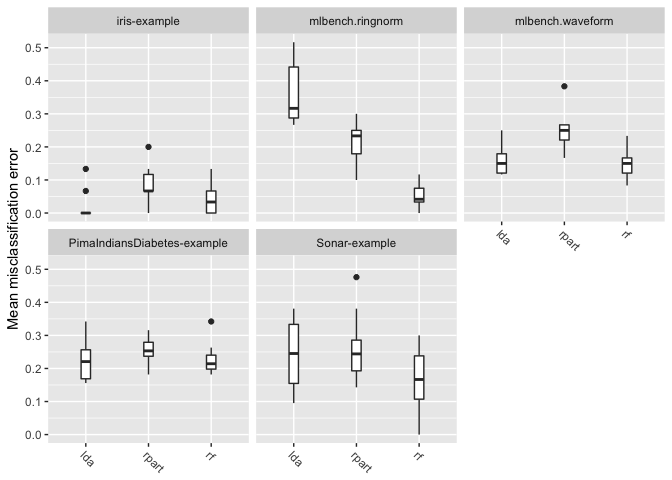
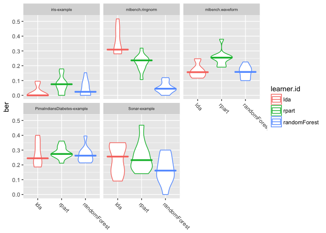

2018-02-28

ベンチマーク試験
================

ベンチマーク試験では、1つ、あるいは複数の性能指標に基いてアルゴリズムを比較するために、異なる学習手法を1つあるいは複数のデータセットに適用する。

`mlr`では`benchmark`関数に学習器とタスクをリストで渡すことでベンチマーク試験を実施できる。`benchmark`は通常、学習器とタスクの対に対してリサンプリングを実行する。タスクと性能指標の組み合わせに対してどのようなリサンプリング手法を適用するかは選択することができる。

ベンチマーク試験の実施
----------------------

小さな例から始めよう。線形判別分析(lda)と分類木(rpart)を`sonar.task`に適用する。リサンプリング手法はホールドアウト法を用いる。

以下の例では`ResampleDesc`オブジェクトを作成する。各リサンプリングのインスタンスは`benchmark`関数によって自動的に作成される。インスタンス化はタスクに対して1度だけ実行される。つまり、全ての学習器は全くおなじ訓練セット、テストセットを用いることになる。なお、明示的に`ResampleInstance`を渡しても良い。

もし、データセットの作成を無作為ではなく任意に行いたければ、`makeFixedHoldoutinstance`を使うと良いだろう。

``` r
lrns = list(makeLearner("classif.lda"), makeLearner("classif.rpart"))

rdesc = makeResampleDesc("Holdout")

bmr = benchmark(lrns, sonar.task, rdesc)
```

    $> Task: Sonar-example, Learner: classif.lda

    $> [Resample] holdout iter 1: mmce.test.mean= 0.3
    $> [Resample] Aggr. Result: mmce.test.mean= 0.3
    $> Task: Sonar-example, Learner: classif.rpart
    $> [Resample] holdout iter 1: mmce.test.mean=0.343
    $> [Resample] Aggr. Result: mmce.test.mean=0.343

``` r
bmr
```

    $>         task.id    learner.id mmce.test.mean
    $> 1 Sonar-example   classif.lda      0.3000000
    $> 2 Sonar-example classif.rpart      0.3428571

もし`makeLearner`に学習器の種類以外の引数を指定するつもりがなければ、明示的に`makeLearner`を呼び出さずに単に学習器の名前を指定しても良い。上記の例は次のように書き換えることができる。

``` r
## 学習器の名前だけをベクトルで指定しても良い
lrns = c("classif.lda", "classif.rpart")

## 学習器の名前とLearnerオブジェクトを混ぜたリストでも良い
lrns = list(makeLearner("classif.lda", predict.type = "prob"), "classif.rpart")

bmr = benchmark(lrns, sonar.task, rdesc)
```

    $> Task: Sonar-example, Learner: classif.lda

    $> [Resample] holdout iter 1: mmce.test.mean= 0.3
    $> [Resample] Aggr. Result: mmce.test.mean= 0.3
    $> Task: Sonar-example, Learner: classif.rpart
    $> [Resample] holdout iter 1: mmce.test.mean= 0.3
    $> [Resample] Aggr. Result: mmce.test.mean= 0.3

``` r
bmr
```

    $>         task.id    learner.id mmce.test.mean
    $> 1 Sonar-example   classif.lda            0.3
    $> 2 Sonar-example classif.rpart            0.3

`print`の結果は各行がタスクと学習器の1つの組合せに対応している。ここでは分類のデフォルトの指標である平均誤分類率が示されている。

`bmr`は`BenchmarcResult`クラスのオブジェクトである。基本的には、これは`ResampleResult`クラスのオブジェクトのリストのリストを含んでおり、最初のリストはタスク、その中のリストは学習器に対応した並びになっている。

### 実験を再現可能にする

一般的にいって、実験は再現可能であることが望ましい。`mlr`は`set.seed`関数の設定に従うので、スクリプト実行前に`set.seed`によって乱数種を固定しておけば再現性が確保できる。

もし並列計算を使用する場合は、ユースケースに合わせて`set.seed`の呼び出し方を調整する必要がある。例えば、`set.seed(123, "L'Ecuyer")`と指定すると子プロセス単位で再現性が確保できる。mcapplyの例([mclapply function | R Documentation](https://www.rdocumentation.org/packages/parallel/versions/3.4.1/topics/mclapply))を見ると並列計算と再現性に関するもう少し詳しい情報が得られるだろう(訳注:こちらのほうが良いかも？[R: Parallel version of lapply](https://rforge.net/doc/packages/multicore/mclapply.html))。

ベンチマーク結果へのアクセス
----------------------------

`mlr`は`getBMR<抽出対象>`という名前のアクセサ関数を幾つか用意している。これにより、さらなる分析のために情報を探索することができる。これには検討中の学習アルゴリズムに関するパフォーマンスや予測などが含まれる。

### 学習器の性能

先程のベンチマーク試験の結果を見てみよう。`getBMRPerformances`は個々のリサンプリング毎の性能指標を返し、`getMBRAggrPerformances`は性能指標の集約値を返す。

``` r
getBMRPerformances(bmr)
```

    $> $`Sonar-example`
    $> $`Sonar-example`$classif.lda
    $>   iter mmce
    $> 1    1  0.3
    $> 
    $> $`Sonar-example`$classif.rpart
    $>   iter mmce
    $> 1    1  0.3

``` r
getBMRAggrPerformances(bmr)
```

    $> $`Sonar-example`
    $> $`Sonar-example`$classif.lda
    $> mmce.test.mean 
    $>            0.3 
    $> 
    $> $`Sonar-example`$classif.rpart
    $> mmce.test.mean 
    $>            0.3

今回の例ではリサンプリング手法にホールドアウト法を選んだので、リサンプリングは1回しか行っていない。そのため、個々のリサンプリング結果に基づく性能指標と集約値はどちらも同じ表示結果になっている。

デフォルトでは、ほぼすべてのゲッター関数ネストされたリストを返す。リストの最初のレベルはタスクで分類されており、二番目のレベルは学習器での分類になる。学習器またはタスクが1つしかない場合は、`drop = TRUE`を指定するとフラットなリストを得ることもできる。

``` r
getBMRPerformances(bmr, drop = TRUE)
```

    $> $classif.lda
    $>   iter mmce
    $> 1    1  0.3
    $> 
    $> $classif.rpart
    $>   iter mmce
    $> 1    1  0.3

大抵の場合はデータフレームの方が便利だろう。`as.df = TRUE`を指定すると結果をデータフレームに変換できる。

``` r
getBMRPerformances(bmr, as.df = TRUE)
```

    $>         task.id    learner.id iter mmce
    $> 1 Sonar-example   classif.lda    1  0.3
    $> 2 Sonar-example classif.rpart    1  0.3

### 予測

デフォルトでは、`BenchmarkResult`は学習器の予測結果も含んでいる。もし、メモリ節約などの目的でこれを止めさせたければ`keep.pred = FALSE`を`benchmark`関数に指定すれば良い。

予測へのアクセスは`getBMRPredictions`関数を使う。デフォルトでは、`ResamplePrediction`オブジェクトのネストされたリストが返ってくる。性能指標の場合と同様に、ここでも`drop`及び`as.df`引数を使うことができる。

``` r
getBMRPredictions(bmr)
```

    $> $`Sonar-example`
    $> $`Sonar-example`$classif.lda
    $> Resampled Prediction for:
    $> Resample description: holdout with 0.67 split rate.
    $> Predict: test
    $> Stratification: FALSE
    $> predict.type: prob
    $> threshold: M=0.50,R=0.50
    $> time (mean): 0.01
    $>    id truth      prob.M       prob.R response iter  set
    $> 1 194     M 0.001914379 9.980856e-01        R    1 test
    $> 2  18     R 0.474564117 5.254359e-01        R    1 test
    $> 3 196     M 0.996712551 3.287449e-03        M    1 test
    $> 4  10     R 0.001307244 9.986928e-01        R    1 test
    $> 5 134     M 0.999999755 2.445735e-07        M    1 test
    $> 6  34     R 0.999761364 2.386361e-04        M    1 test
    $> ... (70 rows, 7 cols)
    $> 
    $> 
    $> $`Sonar-example`$classif.rpart
    $> Resampled Prediction for:
    $> Resample description: holdout with 0.67 split rate.
    $> Predict: test
    $> Stratification: FALSE
    $> predict.type: response
    $> threshold: 
    $> time (mean): 0.01
    $>    id truth response iter  set
    $> 1 194     M        M    1 test
    $> 2  18     R        R    1 test
    $> 3 196     M        M    1 test
    $> 4  10     R        R    1 test
    $> 5 134     M        M    1 test
    $> 6  34     R        M    1 test
    $> ... (70 rows, 5 cols)

``` r
head(getBMRPredictions(bmr, as.df = TRUE))
```

    $>         task.id  learner.id  id truth      prob.M       prob.R response
    $> 1 Sonar-example classif.lda 194     M 0.001914379 9.980856e-01        R
    $> 2 Sonar-example classif.lda  18     R 0.474564117 5.254359e-01        R
    $> 3 Sonar-example classif.lda 196     M 0.996712551 3.287449e-03        M
    $> 4 Sonar-example classif.lda  10     R 0.001307244 9.986928e-01        R
    $> 5 Sonar-example classif.lda 134     M 0.999999755 2.445735e-07        M
    $> 6 Sonar-example classif.lda  34     R 0.999761364 2.386361e-04        M
    $>   iter  set
    $> 1    1 test
    $> 2    1 test
    $> 3    1 test
    $> 4    1 test
    $> 5    1 test
    $> 6    1 test

IDを通じて特定の学習器やタスクの結果にアクセスすることもできる。多くのゲッター関数はIDを指定するための`learner.ids`引数と`task.ids`引数が用意されている。

``` r
head(getBMRPredictions(bmr, learner.ids = "classif.rpart", as.df = TRUE))
```

    $>         task.id    learner.id  id truth response iter  set
    $> 1 Sonar-example classif.rpart 194     M        M    1 test
    $> 2 Sonar-example classif.rpart  18     R        R    1 test
    $> 3 Sonar-example classif.rpart 196     M        M    1 test
    $> 4 Sonar-example classif.rpart  10     R        R    1 test
    $> 5 Sonar-example classif.rpart 134     M        M    1 test
    $> 6 Sonar-example classif.rpart  34     R        M    1 test

デフォルトのIDが嫌なら、`makeLearner`や`make*Task`関数の`id`引数を通じて設定できる。さらに、学習器のIDを簡単に変更するための関数として`setLearnerId`関数も用意されている。

### ID

ベンチマーク試験における学習器、タスク、性能指標のIDは、以下のように取得できる。

``` r
getBMRTaskIds(bmr)
```

    $> [1] "Sonar-example"

``` r
getBMRLearnerIds(bmr)
```

    $> [1] "classif.lda"   "classif.rpart"

``` r
getBMRMeasureIds(bmr)
```

    $> [1] "mmce"

### フィット済みモデル

デフォルトでは`BenchmarkResult`オブジェクトはフィット済みモデルも含んでいる。これは、`benchmark`関数を呼び出す際に`models = FALSE`を指定することで抑制できる。フィット済みモデルは`getBMRModels`関数を使うことで確認できる。この関数が返すのは(おそらくネストされた)`WrappedModel`オブジェクトのリストである。

``` r
getBMRModels(bmr)
```

    $> $`Sonar-example`
    $> $`Sonar-example`$classif.lda
    $> $`Sonar-example`$classif.lda[[1]]
    $> Model for learner.id=classif.lda; learner.class=classif.lda
    $> Trained on: task.id = Sonar-example; obs = 138; features = 60
    $> Hyperparameters: 
    $> 
    $> 
    $> $`Sonar-example`$classif.rpart
    $> $`Sonar-example`$classif.rpart[[1]]
    $> Model for learner.id=classif.rpart; learner.class=classif.rpart
    $> Trained on: task.id = Sonar-example; obs = 138; features = 60
    $> Hyperparameters: xval=0

### 学習器と性能指標

使用された学習器は`getBMRLearners`で、性能指標は`getBMRMeasures`でそれぞれ抽出できる。

``` r
getBMRLearners(bmr)
```

    $> $classif.lda
    $> Learner classif.lda from package MASS
    $> Type: classif
    $> Name: Linear Discriminant Analysis; Short name: lda
    $> Class: classif.lda
    $> Properties: twoclass,multiclass,numerics,factors,prob
    $> Predict-Type: prob
    $> Hyperparameters: 
    $> 
    $> 
    $> $classif.rpart
    $> Learner classif.rpart from package rpart
    $> Type: classif
    $> Name: Decision Tree; Short name: rpart
    $> Class: classif.rpart
    $> Properties: twoclass,multiclass,missings,numerics,factors,ordered,prob,weights,featimp
    $> Predict-Type: response
    $> Hyperparameters: xval=0

``` r
getBMRMeasures(bmr)
```

    $> [[1]]
    $> Name: Mean misclassification error
    $> Performance measure: mmce
    $> Properties: classif,classif.multi,req.pred,req.truth
    $> Minimize: TRUE
    $> Best: 0; Worst: 1
    $> Aggregated by: test.mean
    $> Note: Defined as: mean(response != truth)

ベンチマーク結果のマージ
------------------------

ベンチマーク試験が終わった後で、他の学習器やタスクを追加したくなったらどうすればよいだろうか。このような場合は、`mergeBenchmarkResults`関数を使えば、複数の`BenchmarkResutl`オブジェクトをマージすることができる。

先程行った線形判別分析と決定木のベンチマーク試験結果に対し、ランダムフォレストと二次判別分析の結果を追加してみよう。

まず、ランダムフォレストと二次判別分析のベンチマーク試験を行う。

``` r
lrns2 = list(makeLearner("classif.randomForest"), makeLearner("classif.qda"))
bmr2 = benchmark(lrns2, sonar.task, rdesc, show.info = FALSE)
bmr2
```

    $>         task.id           learner.id mmce.test.mean
    $> 1 Sonar-example classif.randomForest      0.2285714
    $> 2 Sonar-example          classif.qda      0.5142857

次に、`bmr`と`bmr2`をマージする。`BenchmarkResult`オブジェクトはリストで渡す。

``` r
mergeBenchmarkResults(list(bmr, bmr2))
```

    $>         task.id           learner.id mmce.test.mean
    $> 1 Sonar-example          classif.lda      0.3000000
    $> 2 Sonar-example        classif.rpart      0.3000000
    $> 3 Sonar-example classif.randomForest      0.2285714
    $> 4 Sonar-example          classif.qda      0.5142857

上記の例ではリサンプルdescriptionを`benchmark`関数に指定していることに注意してもらいたい。つまり、`lda`と`rpart`は`randamForest`および`qda`とは異なる訓練/テストセットを用いて評価された可能性が高い。

異なる訓練/テストセットを用いて評価を行うと、学習器間の正確な性能比較が難しくなる。もし、他の学習器を使った試験を後から追加する見込みがあるのなら、最初から`ResampleInstances`を使用したほうが良い。リサンプルをインスタンス化しておけば、同じ訓練/テストセットを後の試験でも使用することができるからだ。

あるいは、`BenchmarkResult`オブジェクトから`ResampleInstance`を抽出し、これを他の試験に使用しても良い。例を示そう。

``` r
# インスタンスの抽出
rin = getBMRPredictions(bmr)[[1]][[1]]$instance

# インスタンスを用いてベンチマーク試験を行う
bmr3 = benchmark(lrns2, sonar.task, rin, show.info = FALSE)

# 結果をマージする
mergeBenchmarkResults(list(bmr, bmr3))
```

    $>         task.id           learner.id mmce.test.mean
    $> 1 Sonar-example          classif.lda      0.3000000
    $> 2 Sonar-example        classif.rpart      0.3000000
    $> 3 Sonar-example classif.randomForest      0.2142857
    $> 4 Sonar-example          classif.qda      0.2714286

ベンチマークの分析と可視化
--------------------------

`mlr`はベンチマーク試験を分析する機能も備えている。これには、可視化、アルゴリズムの順位付け、パフォーマンスの差に対する仮説検定が含まれる。

今回はこの機能を紹介するために、5つの分類タスクと3つの学習アルゴリズムを使用する、やや大きなベンチマーク試験を実施する。

### 例：線形判別分析と分類木、ランダムフォレストの比較

**3つのアルゴリズム**は線形判別分析、決定木、ランダムフォレストである。これらのデフォルトの学習器IDはやや長いので、以下の例ではもう少し短い別名を設定した。

**5つの分類タスク**と言ったが、3つは既に紹介したものだ。これに加えて、`mlbench`パッケージに含まれるデータを`convertMLBenchObjToTask`関数でタスクに変換したものを用いる。

全てのタスクは10分割クロスバリデーションによりリサンプリングを行う。これは、一つのresample descriptionを`benchmark`関数に渡すことで行う。これにより、それぞれのタスクに対するリサンプリングのインスタンス化が自動的に実行される。この方法では、一つのタスク内で全ての学習器に対して同じインスタンスが使用されることになる。

タスクの数と同じ長さのリストでリサンプリング手法を指定すれば、それぞれのタスクに異なるリサンプリング手法を適用することもできる。この際渡すのはresample descriptionsでも良いし、インスタンスでも良い。

評価手法は平均誤分類率を主とするが、合わせてbalanced error rate(ber)と訓練時間(timetrain)も算出する。

``` r
## 学習器リストの作成
lrns = list(
  makeLearner("classif.lda", id = "lda"),
  makeLearner("classif.rpart", id = "rpart"),
  makeLearner("classif.randomForest", id = "randomForest")
)

## mlbenchパッケージから追加タスクを生成する
ring.task = convertMLBenchObjToTask("mlbench.ringnorm", n = 600)
```

    $> Loading required package: mlbench

``` r
wave.task = convertMLBenchObjToTask("mlbench.waveform", n = 600)

## タスクリストの作成
tasks = list(iris.task, sonar.task, pid.task, ring.task, wave.task)
## リサンプリング手法の指定
rdesc = makeResampleDesc("CV", iters = 10)
## 評価指標の指定
meas = list(mmce, ber, timetrain)
## ベンチマーク試験の実行
bmr = benchmark(lrns, tasks, rdesc, meas, show.info = FALSE)
bmr
```

    $>                        task.id   learner.id mmce.test.mean ber.test.mean
    $> 1                 iris-example          lda     0.02000000    0.01785714
    $> 2                 iris-example        rpart     0.08000000    0.07492063
    $> 3                 iris-example randomForest     0.04666667    0.04456349
    $> 4             mlbench.ringnorm          lda     0.36166667    0.35984053
    $> 5             mlbench.ringnorm        rpart     0.21666667    0.22203883
    $> 6             mlbench.ringnorm randomForest     0.05166667    0.05165390
    $> 7             mlbench.waveform          lda     0.16000000    0.16704604
    $> 8             mlbench.waveform        rpart     0.25166667    0.25329064
    $> 9             mlbench.waveform randomForest     0.14833333    0.15413098
    $> 10 PimaIndiansDiabetes-example          lda     0.22551265    0.27596728
    $> 11 PimaIndiansDiabetes-example        rpart     0.25666439    0.28331498
    $> 12 PimaIndiansDiabetes-example randomForest     0.22805878    0.26852688
    $> 13               Sonar-example          lda     0.24595238    0.24102550
    $> 14               Sonar-example        rpart     0.26404762    0.25660742
    $> 15               Sonar-example randomForest     0.16928571    0.16694722
    $>    timetrain.test.mean
    $> 1               0.0030
    $> 2               0.0043
    $> 3               0.0439
    $> 4               0.0079
    $> 5               0.0122
    $> 6               0.4268
    $> 7               0.0078
    $> 8               0.0119
    $> 9               0.4063
    $> 10              0.0181
    $> 11              0.0061
    $> 12              0.3602
    $> 13              0.0180
    $> 14              0.0151
    $> 15              0.2738

iris-exampleとPimaIndiansDiabetes-exampleでは線形判別分析が優れいているが、他のタスクではランダムフォレストが良い成績を出しているようだ。一方、訓練時間を見るとランダムフォレストは他の学習器よりも長い時間がかかっている。

パフォーマンスの平均値から何らかの結論を言いたければ、値の変動も考慮に入れる必要がある。リサンプリングの繰り返し全体で値がどのように分布しているかも考慮できれば尚良い。

10分割クロスバリデーションにより、各タスクは10回評価されていることになるが、これは以下の様にして詳細を確認できる。

``` r
perf = getBMRPerformances(bmr, as.df = TRUE)
head(perf)
```

    $>        task.id learner.id iter       mmce        ber timetrain
    $> 1 iris-example        lda    1 0.06666667 0.08333333     0.003
    $> 2 iris-example        lda    2 0.00000000 0.00000000     0.003
    $> 3 iris-example        lda    3 0.00000000 0.00000000     0.002
    $> 4 iris-example        lda    4 0.00000000 0.00000000     0.003
    $> 5 iris-example        lda    5 0.00000000 0.00000000     0.004
    $> 6 iris-example        lda    6 0.00000000 0.00000000     0.003

結果を詳しく確認すると、ランダムフォレストは全てのインスタンスで分類木より優れており、線形判別分析は時間の面でほとんどどの場合も優れている事が分かる。また、線形判別分析は時々ランダムフォレストより優れた結果を出している。このサイズの試験結果ならまだ「詳しく確認する」は可能であるが、これよりももっと大きなスケールのベンチマーク試験では、このような判断はずっと難しくなる。

`mlr`には可視化と仮説検定の仕組みがあるので、より大きなスケールの試験に対してはそれを使おう。

### 可視化

プロットには`ggplot2`パッケージが使用される。したがって、要素のリネームや配色変更などのカスタマイズは容易に行える。

#### パフォーマンスの可視化

`plotBMRBoxplot`は箱ひげ図またはバイオリンプロットによって、リサンプリングの繰り返しの間に指標がどのような値をとったのかを可視化する。これはつまり`getBMRPerformances`の可視化である。

以下に箱ひげ図で`mmce`の分布を示す。

``` r
plotBMRBoxplots(bmr, measure = mmce)
```



次にバイオリンプロットの例を示す。

``` r
# aes, theme, element_textをggplot2::なしで呼び出すためには
# ライブラリのロードが必要
library(ggplot2) 
plotBMRBoxplots(bmr, measure = ber, style = "violin",
                pretty.names = FALSE) +
  aes(color = learner.id) +
  theme(strip.text.x = element_text(size = 6))
```



ここでは、指標として`ber`を使用するとともに、`learner.id`に基づく色の塗り分けも行っている。また、`theme`はグラフのラベル(strip)のフォントサイズを調整している。

`pretty.names=FALSE`は何かというと、性能指標や学習器のラベルとしてidを使ってくれという指定である。これを指定しなかったときにどのような名前が使われるかは、性能指標であれば`指標名$name`、学習器では`getBMRLEarnerShortName`で確認できる。

``` r
mmce$name
```

    $> [1] "Mean misclassification error"

``` r
getBMRLearnerShortNames(bmr)
```

    $> [1] "lda"   "rpart" "rf"

プロットに関してよくある質問は、「パネルのヘッダと学習器の名前はどうやったら変更できるのか」といったものだ。
